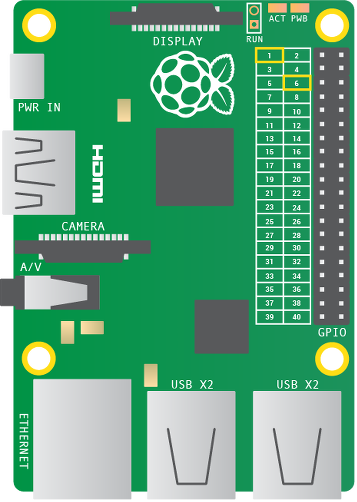
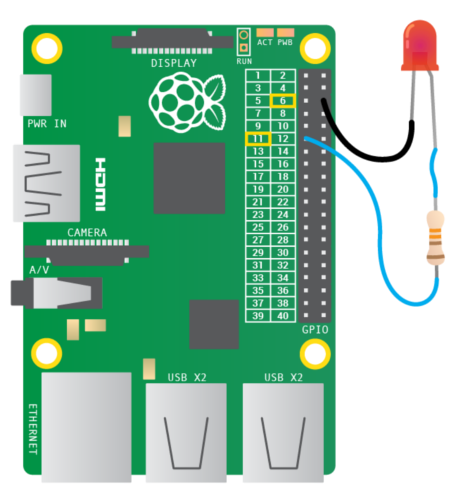

# Robot Antenne

Nous allons créer un robot qui bip et a une antenne qui clignote en utilisant un Raspberry Pi.

## Fabriquez une antenne pour votre robot avec une LED

Commençons avec l’électronique ! C’est là où le Raspberry Pi sera utile. Vous allez programmer une petite lumière, qu’on appelle LED (en français DEL : diode électroluminescente) pour qu’elle clignote. D’abord vous aurez besoin de créer un circuit.

1.  La LED a un pied court et un pied long. Insérer un fil dans le pied long.

2.  Insérer la résistance dans l’autre bout du fil.

3.  Ajouter un autre fil dans l’autre bout de la résistance.

4.  Prenez un autre fil et insérez un bout dans le pied court de la LED. Vous devez avoir quelque chose comme ça à la fin :

    

5.  Trouvez la première broche `3v3` et une broche `GND` dans votre Raspberry Pi en utilisant le schéma ci-après :

    

    Le but général des broches entrée/sortie (GPIO) d’un Raspberry Pi c’est de communiquer avec le monde en extérieur et être contrôlable et programmable.  Chaque broche a un rôle spécifique. Pour nous faciliter la vie, chaque broche a un numéro de référence. Une broche `3v3` est pour l’alimentation et `GND` est pour la mise à la terre.

6.  Branchez le fil avec la résistance dans la broche `3v3` de votre Raspberry Pi et l’autre fil dans la broche *GND*.

7.  Branchez le micro USB pour l’alimentation et vous devez voir un texte qui s’affiche sur votre écran.

### Comment fonctionne la lumière de l’antenne

Maintenant vous avez un circuit et la LED soit s’allumer. Si ce n’est pas le cas, assurez-vous que vous avez branché les fils dans les bonnes broches en vérifiant le schéma en dessus. 

Donc, pourquoi la LED s’allume ?

Quand le circuit est branché dans les broches GPIO de Raspberry Pi, l’électricité peut circuler à travers de celui-ci. Cette circulation s’appelle le courant. La LED s’allume seulement quand le courant électrique circule du pied long, à travers l’ampoule et jusqu’au pied court. 

La résistance diminue la quantité de courant électrique qui passe à travers le circuit. Cela protège la LED de s’abîmer, car un courant élevé pourrait faire la lumière briller encore plus et ensuite s’arrêter de fonctionner.

Bravo ! Vous avez fait l’antenne pour votre robot. Maintenant il faut faire un peu de programmation pour la contrôler. 

## Faites clignoter l’antenne avec le code

Maintenant que votre antenne s’allume, vous pouvez écrire un programme pour dire à la LED quand vous voulez qu’elle s’allume.

Pour cela vous aurez besoin d’utiliser la broche `17` plutôt que la `3v3` pour alimenter votre LED. La broche 17 est spéciale car elle peut s’allumer et s’éteindre- quand vous le voulez ! Suivez les instructions ci-dessous pour apprendre comment changer des broches.

1.  Eteindre votre Raspberry Pi et enlever le câble d’alimentation. Changer la position de votre fil qui est connecté à la résistance de la broche `3v3` à la broche GPIO `17`. Regardez le schéma ci-après pour vous rassurer que le circuit est correct :

    

2.  Connectez le câble de l’alimentation à votre Raspberry Pi et attendez pour que ça démarre.

3.  Ouvrez Scratch en cliquant sur **Menu** et **Programmation**, suivi par **Scratch**.

4.  Cliquer sur **Edit** et **Start GPIO server** s’il n’a pas été déjà démarré.

 
 
5. Clic-droit sur le chat de Scratch et sélectionnez **supprimer** dans le menu.

6.  Ensuite cliquez sur le bouton pour ouvrir un nouveau lutin et choisissez **robot3** du dossier **fantasy**.

    

7.  Cliquez sur **contrôle**. Glissez le bloc `quand drapeau vert pressé` dans la zone de scripts. Ensuite connectez un bloc `broadcast` en dessous. Cliquez sur le menu déroulant dans le bloc `broadcast` et sélectionnez **new**.
Dans le message nommez le type de boîte `config17output`. Cette instruction dira au Raspberry Pi que la broche 17 sera une sortie. Cela est parce que vous dites à la broche d’allumer et éteindre une LED qui est un composant de sortie.  

    

8.  Glissez le bloc `quand espace pressé` dans la zone de scripts. Ensuit cliquez sur Sound et glisser le bloc `play sound` dans la zone de script et connectez-le dans le bloc de contrôle. 

9.  Cliquez sur l’étiquette **Sounds** qui se trouve au-dessus de la zone de scripts et ensuite cliquez sur **Importer**. Sélectionnez **Electronique** et ensuite **ComputerBeeps2**. Cela va l’ajouter dans l’étiquette de sons. 

10.  Maintenant retournez dans la zone de scripts en cliquant sur l’étiquette de scripts. Cliquez sur la case roulante qui se trouve à côté de « play sound ». Selectionnez le son que vous venez d’importer dans le menu.

    

11. Testez que le programme fonctionne jusque là, en appuyant la touche espace. Il doit bipper !

12. Enregistrer votre travail en cliquant sur **Fichier** et **Enregistrer sous**. Nommer votre fichier **Robot** et cliquer sur **OK**.

13.	Cliquer sur **contrôle** dans la palette de blocs et glisser un bloc `broadcast` dans la zone de scripts et attachez-le au bloc play sound. Cliquez sur le menu déroulant dans le bloc de broadcast et selectionnez **nouveau**.

    Dans le message nommez le type de case `gpio17on`. Cette instruction dira au Raspberry Pi d’allumer la LED.

    

14.	Glissez un bloc `wait 1 second` dans la zone de script et connectez-le au bloc `broadcast`.

15.	Testez votre programme en cliquant sur le lutin robot. Vous devez voir une LED qui s’allume et reste allumée.

16.	Glissez un autre bloc `broadcast` dans la zone de script et connectez-le au bloc `wait 1 second`.
Cliquez sur le menu déroulant dans le bloc « broadcast » et sélectionnez **new**.

    Dans le message nommez le type de case `gpio17off`. Cela éteindra la LED.

17.	Maintenant ajouter un autre bloc `wait 1 second` dans le script.

18.	Tester votre programme encore en cliquant sur le lutin de robot. Vous devez voir la LED s’allumer pour une seconde et s’éteindre pour une seconde.

    

## Fabriquez un robot en carton

Vous allez construire un robot en carton et lui ajouter l’antenne de lumière.

1.	Sur un papier A4, dessinez ou imprimez votre robot. Il doit être dessiné en portrait pour qu’il puisse s’enrouler autour de votre carton de tube. Assurez-vous qu’il a une antenne !

2.	Colorez l’intérieur du robot et coupez-le.

3.	Enroulez le robot autour du tube de carton dans sa longueur.

    

4.	Collez ou scotchez le robot.

5.	Collez la pâte à modeler ou la Patafix derrière l’antenne du robot à l’intérieur du tube de carton.

    

6.	Appuyez avec un crayon l’antenne pour faire un trou à travers le tube de carton.

    

7.	Enlever la patafix.

8.	Mettez le circuit des fils, LED, et résistance à l’intérieur du tube de carton. Appuyez sur la LED à travers le trou dans le tube pour faire l’antenne de robot.

9.	Donnez un nom à votre robot et souhaitez-lui la bienvenue dans le monde.

**Félicitations ! Votre robot est prêt !**

## Pour aller plus loin

-	Est-ce que vous pouvez faire l’antenne rester allumer plus longtemps ?
-	Est-ce que vous pouvez faire la lumière clignoter plus d’une fois ?
-	Essayez d’enregistrer de nouveaux sons quand votre programme est exécuté.

